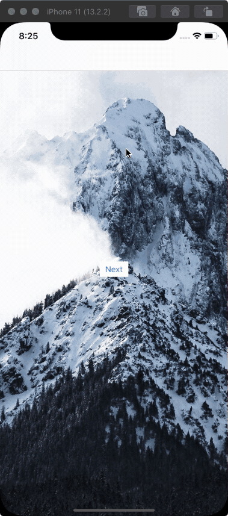

# DynamicTransition

## Add to project

Add the Swift Package in Xcode.

## Snap



### Activate

```swift
class ViewController: UIViewController {

  let navigationControllerDelegate = DynamicsNavigationControllerDelegate()
  
  override func viewDidLoad() {
    super.viewDidLoad()
        
    navigationControllerDelegate.type = .gravity
    navigationController?.delegate = navigationControllerDelegate
  }
}
```

## Gravity


### Activate

```swift
class ViewController: UIViewController {

  let navigationControllerDelegate = DynamicsNavigationControllerDelegate()
  
  override func viewDidLoad() {
    super.viewDidLoad()
        
    navigationControllerDelegate.type = .snap
    navigationController?.delegate = navigationControllerDelegate
  }
}
```

## Author

Dominik Hauser
Twitter: [@dasdom](https://twitter.com/dasdom)

## Licence

MIT
